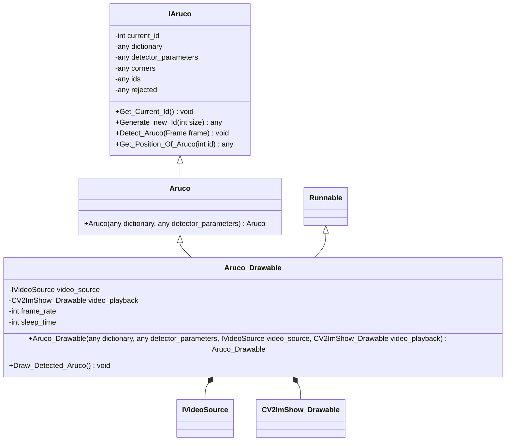

```mermaid
classDiagram
    %% -- Arucos
    IAruco <|-- Aruco
    Aruco <|-- Aruco_Drawable
    Runnable <|-- Aruco_Drawable
    Aruco_Drawable *-- IVideoSource 
    Aruco_Drawable *-- CV2ImShow_Drawable 

    IAruco: -int current_id
    IAruco: -any dictionary
    IAruco: -any detector_parameters
    IAruco: -any corners
    IAruco: -any ids
    IAruco: -any rejected

    IAruco: +Get_Current_Id() void
    IAruco: +Generate_new_Id(int size) any
    IAruco: +Detect_Aruco(Frame frame) void
    IAruco: +Get_Position_Of_Aruco(int id) any

    class Aruco{
       +Aruco(any dictionary, any detector_parameters) Aruco
    }

    class Aruco_Drawable{
        -IVideoSource video_source
        -CV2ImShow_Drawable video_playback
        -int frame_rate
        -int sleep_time

        +Aruco_Drawable(any dictionary, any detector_parameters, IVideoSource video_source, CV2ImShow_Drawable video_playback) Aruco_Drawable
        +Draw_Detected_Aruco() void
    }
```