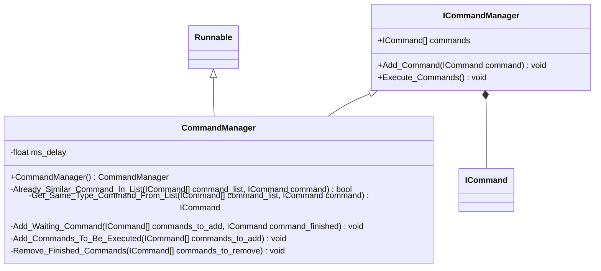

```mermaid
classDiagram
    %% -- CommandManagers
    ICommandManager <|-- CommandManager
    Runnable <|-- CommandManager
    ICommandManager: +ICommand[] commands

    ICommandManager: +Add_Command(ICommand command) void
    ICommandManager: +Execute_Commands() void

    ICommandManager *-- ICommand
    
    class CommandManager{
        -float ms_delay

        +CommandManager() CommandManager
        -Already_Similar_Command_In_List(ICommand[] command_list, ICommand command) bool
        -Get_Same_Type_Command_From_List(ICommand[] command_list, ICommand command) ICommand
        -Add_Waiting_Command(ICommand[] commands_to_add, ICommand command_finished) void
        -Add_Commands_To_Be_Executed(ICommand[] commands_to_add) void
        -Remove_Finished_Commands(ICommand[] commands_to_remove) void
    }
```