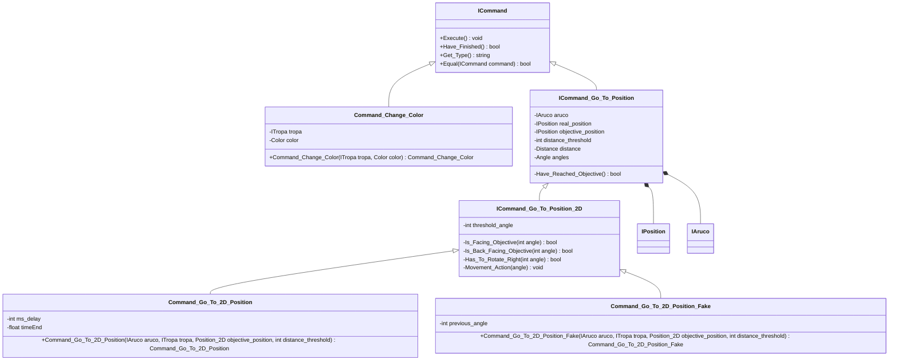

```mermaid
classDiagram
    %% -- Commands
    ICommand <|-- Command_Change_Color
    ICommand <|-- ICommand_Go_To_Position
    ICommand_Go_To_Position <|-- ICommand_Go_To_Position_2D
    ICommand_Go_To_Position_2D <|-- Command_Go_To_2D_Position
    ICommand_Go_To_Position_2D <|-- Command_Go_To_2D_Position_Fake

    ICommand_Go_To_Position *-- IPosition
    ICommand_Go_To_Position *-- IAruco 

    ICommand: +Execute() void
    ICommand: +Have_Finished() bool
    ICommand: +Get_Type() string
    ICommand: +Equal(ICommand command) bool
   
    class Command_Change_Color{
        -ITropa tropa
        -Color color

        +Command_Change_Color(ITropa tropa, Color color) Command_Change_Color
    }

    class ICommand_Go_To_Position {
        -IAruco aruco
        -IPosition real_position
        -IPosition objective_position
        -int distance_threshold
        -Distance distance
        -Angle angles

        -Have_Reached_Objective() bool
    }

    class ICommand_Go_To_Position_2D {
        -int threshold_angle

        -Is_Facing_Objective(int angle) bool
        -Is_Back_Facing_Objective(int angle) bool
        -Has_To_Rotate_Right(int angle) bool
        -Movement_Action(angle) void
    }

    class Command_Go_To_2D_Position {
        -int ms_delay  
        -float timeEnd

        +Command_Go_To_2D_Position(IAruco aruco, ITropa tropa, Position_2D objective_position, int distance_threshold) Command_Go_To_2D_Position
    }

     class Command_Go_To_2D_Position_Fake {
        -int previous_angle

        +Command_Go_To_2D_Position_Fake(IAruco aruco, ITropa tropa, Position_2D objective_position, int distance_threshold) Command_Go_To_2D_Position_Fake
    }
```