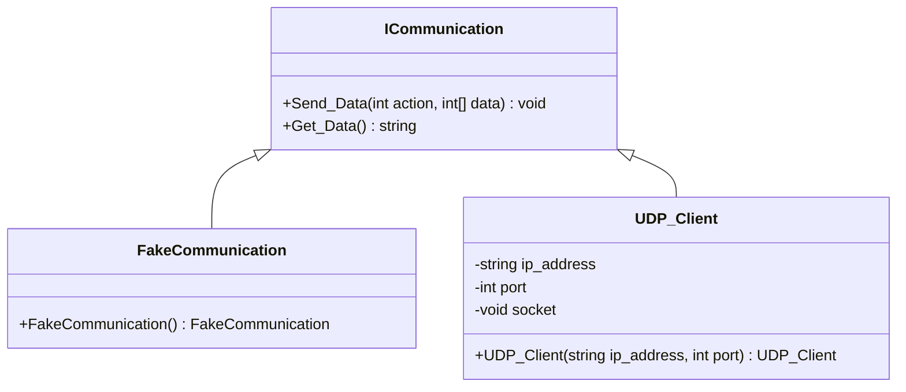

```mermaid
classDiagram
    %% -- Communications
    ICommunication <|-- FakeCommunication
    ICommunication <|-- UDP_Client

    ICommunication: +Send_Data(int action, int[] data) void
    ICommunication: +Get_Data() string
   
    class FakeCommunication{
        +FakeCommunication() FakeCommunication
    }

    class UDP_Client {
        -string ip_address
        -int port
        -void socket

        +UDP_Client(string ip_address, int port) UDP_Client
    }
```