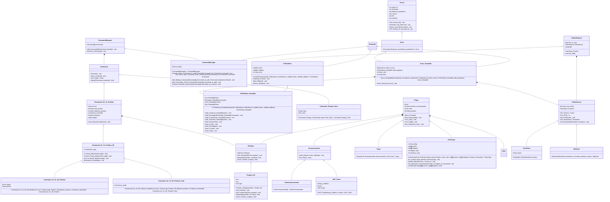

```mermaid
classDiagram
   %% -- Arucos
    IAruco <|-- Aruco
    Aruco <|-- Aruco_Drawable
    Runnable <|-- Aruco_Drawable
    Aruco_Drawable *-- IVideoSource 
    Aruco_Drawable *-- CV2ImShow_Drawable 

    IAruco: -int current_id
    IAruco: -any dictionary
    IAruco: -any detector_parameters
    IAruco: -any corners
    IAruco: -any ids
    IAruco: -any rejected

    IAruco: +Get_Current_Id() void
    IAruco: +Generate_new_Id(int size) any
    IAruco: +Detect_Aruco(Frame frame) void
    IAruco: +Get_Position_Of_Aruco(int id) any

    class Aruco{
       +Aruco(any dictionary, any detector_parameters) Aruco
    }

    class Aruco_Drawable{
        -IVideoSource video_source
        -CV2ImShow_Drawable video_playback
        -int frame_rate
        -int sleep_time

        +Aruco_Drawable(any dictionary, any detector_parameters, IVideoSource video_source, CV2ImShow_Drawable video_playback) Aruco_Drawable
        +Draw_Detected_Aruco() void
    }
       %% -- CommandManagers
    ICommandManager <|-- CommandManager
    Runnable <|-- CommandManager
    ICommandManager: +ICommand[] commands

    ICommandManager: +Add_Command(ICommand command) void
    ICommandManager: +Execute_Commands() void

    ICommandManager *-- ICommand
    
    class CommandManager{
        -float ms_delay

        +CommandManager() CommandManager
        -Already_Similar_Command_In_List(ICommand[] command_list, ICommand command) bool
        -Get_Same_Type_Command_From_List(ICommand[] command_list, ICommand command) ICommand
        -Add_Waiting_Command(ICommand[] commands_to_add, ICommand command_finished) void
        -Add_Commands_To_Be_Executed(ICommand[] commands_to_add) void
        -Remove_Finished_Commands(ICommand[] commands_to_remove) void
    }
     %% -- Commands
    ICommand <|-- Command_Change_Color
    ICommand <|-- ICommand_Go_To_Position
    ICommand_Go_To_Position <|-- ICommand_Go_To_Position_2D
    ICommand_Go_To_Position_2D <|-- Command_Go_To_2D_Position
    ICommand_Go_To_Position_2D <|-- Command_Go_To_2D_Position_Fake

    ICommand_Go_To_Position *-- IPosition
    
    ICommand: +Execute() void
    ICommand: +Have_Finished() bool
    ICommand: +Get_Type() string
    ICommand: +Equal(ICommand command) bool
   
    class Command_Change_Color{
        -ITropa tropa
        -Color color

        +Command_Change_Color(ITropa tropa, Color color) Command_Change_Color
    }

    class ICommand_Go_To_Position {
        -IAruco aruco
        -IPosition real_position
        -IPosition objective_position
        -int distance_threshold
        -Distance distance
        -Angle angles

        -Have_Reached_Objective() bool
    }

    class ICommand_Go_To_Position_2D {
        -int threshold_angle

        -Is_Facing_Objective(int angle) bool
        -Is_Back_Facing_Objective(int angle) bool
        -Has_To_Rotate_Right(int angle) bool
        -Movement_Action(angle) void
    }

    class Command_Go_To_2D_Position {
        -int ms_delay  
        -float timeEnd

        +Command_Go_To_2D_Position(IAruco aruco, ITropa tropa, Position_2D objective_position, int distance_threshold) Command_Go_To_2D_Position
    }

     class Command_Go_To_2D_Position_Fake {
        -int previous_angle

        +Command_Go_To_2D_Position_Fake(IAruco aruco, ITropa tropa, Position_2D objective_position, int distance_threshold) Command_Go_To_2D_Position_Fake
    }
    %% -- Communications
    ICommunication <|-- FakeCommunication
    ICommunication <|-- UDP_Client

    ICommunication: +Send_Data(int action, int[] data) void
    ICommunication: +Get_Data() string
   
    class FakeCommunication{
        +FakeCommunication() FakeCommunication
    }

    class UDP_Client {
        -string ip_address
        -int port
        -void socket

        +UDP_Client(string ip_address, int port) UDP_Client
    }
    %% -- Positions
    IPosition <|-- Position_2D
    
    IPosition: +int[] Get_Position()
    IPosition: +Set_Position(int[] new_position) void
    IPosition: +Equals(int[] position, int offset) bool
    IPosition: -Check_Position_Length() bool

    class Position_2D{
        +int x
        +int y
        +int angle

        +Position_2D(int[] position) Position_2D
        +Get_Position() int[]
        +Set_Position(int[] new_position) void
        +Equals(int[] position, int offset) bool
        -Check_Position_Length() bool
    }
      %% -- Tropas
    ITropa <|-- Tropa
    ITropa <|-- FakeTropa
    ITropa *-- ICommunication
    ITropa *-- IPosition
    ITropa *-- Color
    
    ITropa: +int id
    ITropa: +ICommunication communication
    ITropa: +Color color
    ITropa: +IPosition position

    ITropa: +Move_Forward()
    ITropa: +Move_Backwards() void
    ITropa: +Turn_Left() void
    ITropa: +Turn_Right() void
    ITropa: +Set_Color(Color color)    void
    class FakeTropa{
        -int time_delay
        -int[][][] matrix
        -int[][][] footprint
        +int degree_step
        +int distance_step

        +FakeTropa(int id, ICommunication communication, Color color, int[][][] matrix, int[][][] footprint, Position_2D position) FakeTropa
        -Do_Turn(int angle_direction, bool forward) void
        -Update_Matrix(int pos_x, int pos_y) void
        -Get_Movement_Parameters(int angle, int degree_of_movement) int[]
        -isValidFootPrint(int[][][] matrix, int[][][]footprint) bool
    }
    class Tropa{
        +Tropa(int id, ICommunication communication, Color color) Tropa
    }
      %% -- VideoPlaybacks
    IVideoPlayback <|-- CV2ImShow
    Runnable <|-- CV2ImShow
    CV2ImShow <|-- CV2ImShow_Drawable
    IVideoPlayback  *-- IVideoSource
    
    IVideoPlayback: +bool has_to_stop
    IVideoPlayback: +IVideoSource videoSource
    IVideoPlayback: +string title

    IVideoPlayback: +void Draw_Frame()
    IVideoPlayback: +void Get_Title()
   
    class CV2ImShow{
        -callable action
        -callable callback
        -int sleep_time

        +CV2ImShow(string title, IVideoSource videoSource, callable action, callable callback) CV2ImShow
        -Initializate_Frame() void
        -Add_Callback() void
        -Destroy_Window() void
    }
     class CV2ImShow_Drawable{
        Line_Drawable[] lines
        Rectangle_Drawable[] rectangles
        Circle_Drawable[] circles
        Text_Drawable[] texts

        +CV2ImShow_Drawable(string title, IVideoSource videoSource, callable action, callable callback) CV2ImShow_Drawable
        +Add_Lines(Line_Drawable[] lines) void
        +Add_Rectangles(Rectangle_Drawable[] rectangles) void
        +Add_Circles(Circle_Drawable[] circles) void
        +Add_Texts(Text_Drawable[] texts) void
        -Draw_Geometries() void
        -Draw_Lines() void
        -Draw_Rectangles() void
        -Draw_Circles() void
        -Draw_Text() void    
    }
     %% -- VideoSources
    IVideoSource <|-- FakeVideo
    IVideoSource <|-- WebCam
    
    IVideoSource: +bool has_new_frame
    IVideoSource: +Resolution resolution

    IVideoSource: +Get_Frame() Frame
    IVideoSource: +Get_FPS() int
    IVideoSource: +Set_FPS(int fps) void
    IVideoSource: +Get_Resolution() Resolution
    IVideoSource: +Set_Resolution(Resolution resolution) void
   
    class FakeVideo{
        -Frame frame

        +FakeVideo FakeVideo(Frame frame)
    }

    class WebCam{
        +WebCam(Resolution resolution, int number_webcam, int fps) WebCam
    }
```