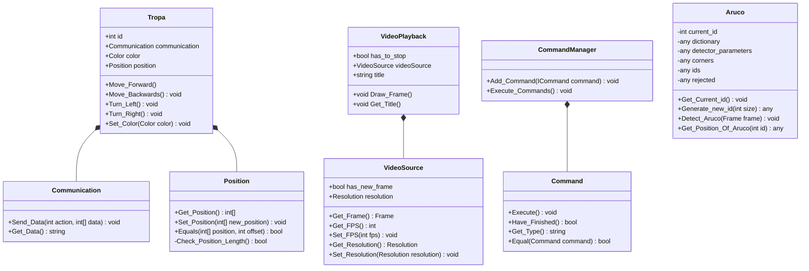

```mermaid
classDiagram
    Tropa *-- Communication
    Tropa *-- Position

    VideoPlayback *-- VideoSource

    CommandManager *-- Command

    class Aruco {
        -int current_id
        -any dictionary
        -any detector_parameters
        -any corners
        -any ids
        -any rejected

        +Get_Current_id() void
        +Generate_new_id(int size) any
        +Detect_Aruco(Frame frame) void
        +Get_Position_Of_Aruco(int id) any
    }

    class Communication {
        +Send_Data(int action, int[] data) void
        +Get_Data() string
    }

    class Command {
        +Execute() void
        +Have_Finished() bool
        +Get_Type() string
        +Equal(Command command) bool
    }

    class CommandManager {
        +Add_Command(ICommand command) void
        +Execute_Commands() void
    }

    class Position {
        +Get_Position() int[]
        +Set_Position(int[] new_position) void
        +Equals(int[] position, int offset) bool
        -Check_Position_Length() bool
    }

    class Tropa {
        +int id
        +Communication communication
        +Color color
        +Position position

        +Move_Forward()
        +Move_Backwards() void
        +Turn_Left() void
        +Turn_Right() void
        +Set_Color(Color color) void
    }

    class VideoPlayback {
        +bool has_to_stop
        +VideoSource videoSource
        +string title

        +void Draw_Frame()
        +void Get_Title()
    }

    class VideoSource {
        +bool has_new_frame
        +Resolution resolution

        +Get_Frame() Frame
        +Get_FPS() int
        +Set_FPS(int fps) void
        +Get_Resolution() Resolution
        +Set_Resolution(Resolution resolution) void        
    }
```