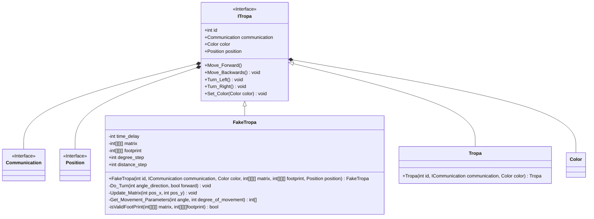

```mermaid
classDiagram
    %% -- Tropas
    ITropa *-- Communication
    ITropa *-- Position    
    ITropa <|-- FakeTropa
    ITropa <|-- Tropa
    ITropa *-- Color
   
    
    class ITropa{
        <<Interface>>
        +int id
        +Communication communication
        +Color color
        +Position position

        +Move_Forward()
        +Move_Backwards() void
        +Turn_Left() void
        +Turn_Right() void
        +Set_Color(Color color) void
    }
   
    class Tropa{
        +Tropa(int id, ICommunication communication, Color color) Tropa
    }
    
    class FakeTropa{
        -int time_delay
        -int[][][] matrix
        -int[][][] footprint
        +int degree_step
        +int distance_step

        +FakeTropa(int id, ICommunication communication, Color color, int[][][] matrix, int[][][] footprint, Position position) FakeTropa
        -Do_Turn(int angle_direction, bool forward) void
        -Update_Matrix(int pos_x, int pos_y) void
        -Get_Movement_Parameters(int angle, int degree_of_movement) int[]
        -isValidFootPrint(int[][][] matrix, int[][][]footprint) bool
    }

    class Communication {
        <<Interface>>
    }

    class Position {
        <<Interface>>
    }
    
```