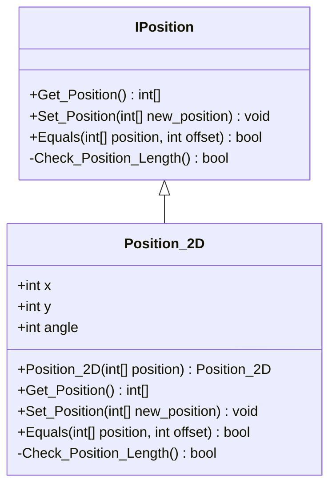

```mermaid
classDiagram
    %% -- Positions
    IPosition <|-- Position_2D
    
    IPosition: +Get_Position() int[] 
    IPosition: +Set_Position(int[] new_position) void
    IPosition: +Equals(int[] position, int offset) bool
    IPosition: -Check_Position_Length() bool

    class Position_2D{
        +int x
        +int y
        +int angle

        +Position_2D(int[] position) Position_2D
        +Get_Position() int[]
        +Set_Position(int[] new_position) void
        +Equals(int[] position, int offset) bool
        -Check_Position_Length() bool
    }
```