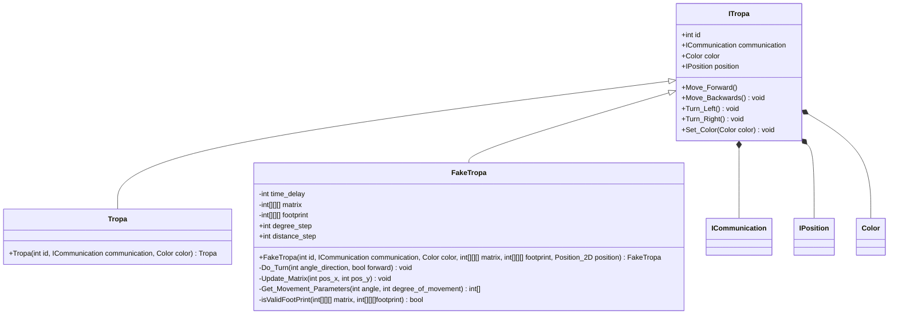

```mermaid
classDiagram
    %% -- Tropas
    ITropa <|-- Tropa
    ITropa <|-- FakeTropa
    ITropa *-- ICommunication
    ITropa *-- IPosition
    ITropa *-- Color
    
    ITropa: +int id
    ITropa: +ICommunication communication
    ITropa: +Color color
    ITropa: +IPosition position

    ITropa: +Move_Forward()
    ITropa: +Move_Backwards() void
    ITropa: +Turn_Left() void
    ITropa: +Turn_Right() void
    ITropa: +Set_Color(Color color) void
    class FakeTropa{
        -int time_delay
        -int[][][] matrix
        -int[][][] footprint
        +int degree_step
        +int distance_step

        +FakeTropa(int id, ICommunication communication, Color color, int[][][] matrix, int[][][] footprint, Position_2D position) FakeTropa
        -Do_Turn(int angle_direction, bool forward) void
        -Update_Matrix(int pos_x, int pos_y) void
        -Get_Movement_Parameters(int angle, int degree_of_movement) int[]
        -isValidFootPrint(int[][][] matrix, int[][][]footprint) bool
    }
    class Tropa{
        +Tropa(int id, ICommunication communication, Color color) Tropa
    }
```