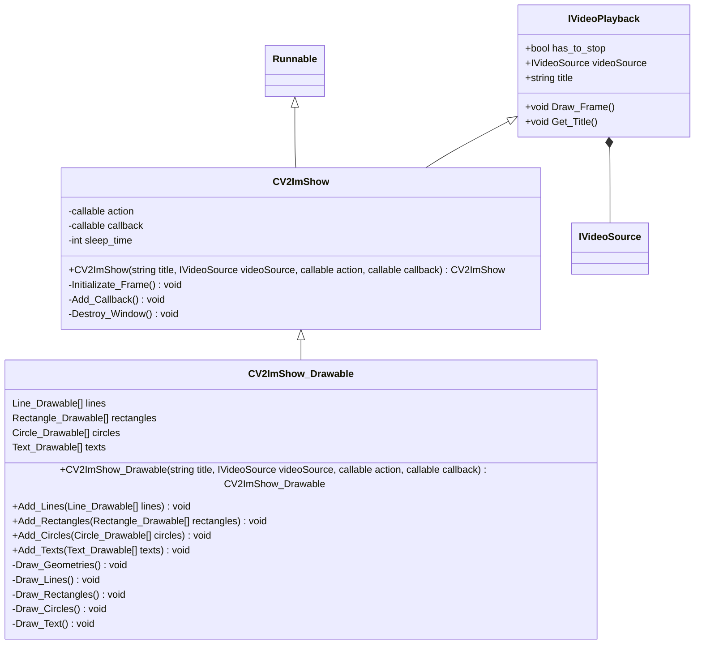

```mermaid
classDiagram
    %% -- VideoPlaybacks
    IVideoPlayback <|-- CV2ImShow
    Runnable <|-- CV2ImShow
    CV2ImShow <|-- CV2ImShow_Drawable
    IVideoPlayback  *-- IVideoSource
    
    IVideoPlayback: +bool has_to_stop
    IVideoPlayback: +IVideoSource videoSource
    IVideoPlayback: +string title

    IVideoPlayback: +void Draw_Frame()
    IVideoPlayback: +void Get_Title()
   
    class CV2ImShow{
        -callable action
        -callable callback
        -int sleep_time

        +CV2ImShow(string title, IVideoSource videoSource, callable action, callable callback) CV2ImShow
        -Initializate_Frame() void
        -Add_Callback() void
        -Destroy_Window() void
    }
     class CV2ImShow_Drawable{
        Line_Drawable[] lines
        Rectangle_Drawable[] rectangles
        Circle_Drawable[] circles
        Text_Drawable[] texts

        +CV2ImShow_Drawable(string title, IVideoSource videoSource, callable action, callable callback) CV2ImShow_Drawable
        +Add_Lines(Line_Drawable[] lines) void
        +Add_Rectangles(Rectangle_Drawable[] rectangles) void
        +Add_Circles(Circle_Drawable[] circles) void
        +Add_Texts(Text_Drawable[] texts) void
        -Draw_Geometries() void
        -Draw_Lines() void
        -Draw_Rectangles() void
        -Draw_Circles() void
        -Draw_Text() void    
    }
   
```