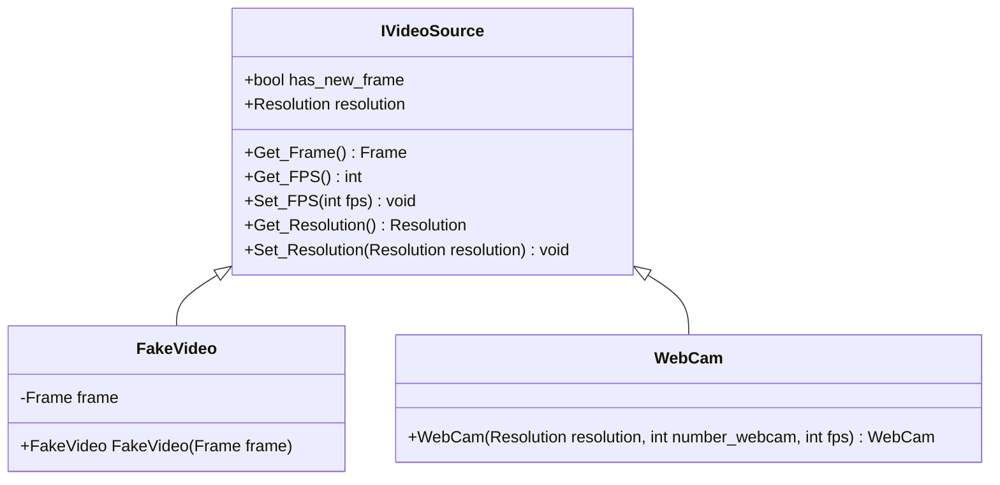

```mermaid
classDiagram
    %% -- VideoSources
    IVideoSource <|-- FakeVideo
    IVideoSource <|-- WebCam
    
    IVideoSource: +bool has_new_frame
    IVideoSource: +Resolution resolution

    IVideoSource: +Get_Frame() Frame
    IVideoSource: +Get_FPS() int
    IVideoSource: +Set_FPS(int fps) void
    IVideoSource: +Get_Resolution() Resolution
    IVideoSource: +Set_Resolution(Resolution resolution) void
   
    class FakeVideo{
        -Frame frame

        +FakeVideo FakeVideo(Frame frame)
    }

    class WebCam{
        +WebCam(Resolution resolution, int number_webcam, int fps) WebCam
    }
   
```